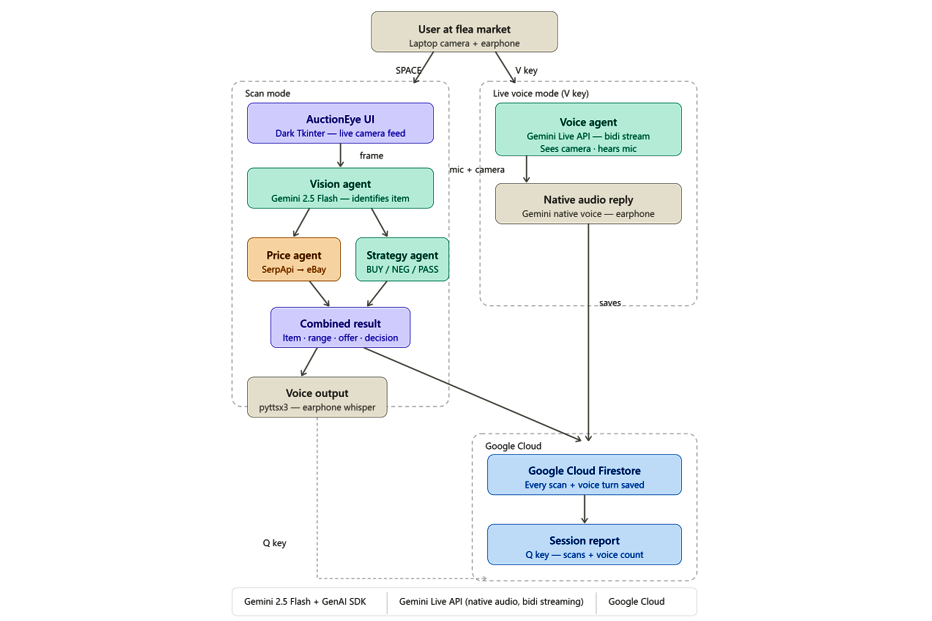

<div align="center">

# AuctionEye

**Real-time flea market AI — point your camera, hear the deal.**

[](https://ai.google.dev/gemini-api/docs/live)
[](https://aistudio.google.com)
[](https://cloud.google.com/firestore)
[](https://python.org)
[](LICENSE)

Submitted to the **Gemini Live Agent Challenge 2026** — Live Agents Category

`#GeminiLiveAgentChallenge`

[**Watch Demo**](#demo) · [**Setup**](#setup) · [**Architecture**](#architecture)

</div>

---

## The Problem

At every flea market, sellers know exactly what their items are worth. Buyers almost never do. That one-sided information gap costs buyers money on every transaction — because by the time you've pulled out your phone and searched, the moment is gone and the seller has seen you do it.

**AuctionEye closes that gap. Invisibly. In real time. Through your earphone.**

---
## Demo

> 🎬 **[Watch 4-minute demo on YouTube](https://youtu.be/Tt-hUL6TSW0?si=KWed0MQVdhKtSh2G)**
---

## App Screenshot


---

## How It Works

AuctionEye has two modes activated by keyboard:

### `SPACE` — Scan Mode
Point the camera at any item and press `SPACE`. The agent identifies the item visually, fetches real eBay sold prices, and whispers the result in your earphone within 10 seconds.

> *"Seiko 5. eBay range $75 to $269. Offer $57. Strong buy."*

### `V` — Live Voice Mode
Press `V` to activate **Gemini Live API** — a fully bidirectional voice and vision session. Speak naturally while the agent watches through your camera in real time.

> **You:** *"They want $40 for this bracelet — is that fair?"*
>
> **AuctionEye:** *"Gold-plated fashion piece. Eight to ten dollars is fair. Walk away at twenty-five."*

### `Q` — Session Report
Press `Q` at the end of the day to hear a spoken summary of everything scanned.

> *"You scanned 1 item and had 1 voice conversations today. Best deal: golden beckoning cat. Potential savings: $99 versus retail prices."*

---

## Architecture



### Four Focused Agents

Each agent does exactly one job, following the multi-agent design principle from Google ADK:

| Agent | Powered By | Responsibility |
|-------|-----------|----------------|
| **Vision Agent** | Gemini 2.5 Flash (multimodal) | Identifies item name, brand and model from the live camera frame |
| **Price Agent** | SerpApi → eBay live listings | Fetches real sold prices and filters outliers for a tight range |
| **Strategy Agent** | Gemini 2.5 Flash | Combines vision and price data to decide BUY, NEGOTIATE, or PASS |
| **Voice Agent** | Gemini Live API (bidirectional) | Real-time voice conversation — sees camera and hears user simultaneously |

---

## Google Cloud Services

| Service | How It Is Used |
|---------|----------------|
| **Gemini 2.5 Flash** | Vision identification and strategic buying reasoning |
| **Gemini Live API** (`gemini-2.5-flash-native-audio-preview-12-2025`) | Real-time bidirectional voice and vision streaming |
| **Google GenAI SDK** | Model access and multimodal prompt construction |
| **Cloud Firestore** | Persistent session memory — every scan and voice turn saved with timestamp |

---

## Proof of Google Cloud Deployment

All Firestore integration is in [`memory.py`](memory.py).

The file uses `google-cloud-firestore` SDK with `firestore.Client()`, live writes via `db.collection().add()`, and `FieldFilter` queries against GCP.

**To verify live:**
1. Run `python ui.py` and press `SPACE` on any item
2. Open [Firestore Console](https://console.cloud.google.com/firestore) → `scanned_items` collection
3. Your record appears instantly, tagged `source: "scan"` or `source: "voice"` with a full timestamp

---

## Setup

### Option A — Automated (one command)

```bash
git clone https://github.com/malathilatha/auctioneye.git
cd auctioneye
bash setup.sh
```

### Option B — Manual

**1. Clone the repository**

```bash
git clone https://github.com/malathilatha/auctioneye.git
cd auctioneye
```

**2. Install all dependencies**

```bash
pip install google-genai google-cloud-firestore opencv-python \
            pillow pyttsx3 google-search-results sounddevice numpy
```

**3. Set your API keys**

Copy the environment template and fill in your keys:

```bash
cp .env.example .env
```

Or set them directly:

*Windows*
```cmd
set GEMINI_KEY=your_gemini_api_key_here
set SERPAPI_KEY=your_serpapi_key_here
```

*Mac / Linux*
```bash
export GEMINI_KEY=your_gemini_api_key_here
export SERPAPI_KEY=your_serpapi_key_here
```

Get your keys here:
- Gemini Api key → [aistudio.google.com/app/apikey](https://aistudio.google.com/app/apikey)
- SerpApi key → [serpapi.com](https://serpapi.com) *(100 free searches per month)*

**4. Set up Firestore**

1. Go to [console.cloud.google.com](https://console.cloud.google.com)
2. Enable **Cloud Firestore** → Native mode → `nam5` region
3. IAM and Admin → Service Accounts → Create → Role: **Cloud Datastore User**
4. Keys → Add Key → JSON → save as `firestore-key.json` in the project root

**5. Run**

```bash
python ui.py           # Full dark-theme UI
python live_camera.py  # Terminal version
```

| Key | Action |
|-----|--------|
| `SPACE` | Scan item — eBay price analysis and voice advice |
| `V` | Toggle Live Voice mode — speak freely, agent watches camera |
| `Q` | Speak session report and quit |

> **Use earphones.** This prevents the microphone from picking up speaker output.

---

## Third-Party Integrations

All third-party tools used in this project:

| Tool | Purpose |
|------|---------|
| [SerpApi](https://serpapi.com) | eBay listing search — real sold prices, 100 free per month |
| [OpenCV](https://opencv.org) | Live camera capture |
| [sounddevice](https://pypi.org/project/sounddevice/) | Audio input and output, Python 3.14 compatible |
| [pyttsx3](https://pypi.org/project/pyttsx3/) | Offline text-to-speech for session report |
| [Pillow](https://python-pillow.org) | Image preprocessing for Gemini vision |

---

## File Structure

```
auctioneye/
├── live_camera.py              # Terminal app — SPACE scan + V voice + Q report
├── ui.py                       # Full Tkinter UI — dark premium theme
├── price_search.py             # SerpApi eBay search with outlier filter
├── memory.py                   # Google Cloud Firestore session memory
├── setup.sh                    # Automated setup script (IaC)
├── .env.example                # Environment variable template
├── AuctionEye_Architecture.png # System architecture diagram
├── AuctionEye_UI.png              # App screenshot — add before submitting
└── README.md
```

---

## Why It Works

**Real prices, not guesses.** SerpApi pulls actual eBay sold listings — not AI estimates. An outlier filter trims the top and bottom 20% of results, giving a tight and actionable price range every time.

**Two modes for every situation.** The scan mode gives a calculated offer price in under 10 seconds. Live voice lets you ask follow-up questions and negotiate in real time while your eyes stay on the seller.

**Invisible intelligence.** No screen to check. No typing required. Voice in, voice out — the agent is a whisper in your ear that nobody else can hear.

**Memory that compounds.** Every scan and voice conversation saves to Firestore. The end-of-day report turns individual decisions into a complete picture of your savings.

---

<div align="center">

Built for the Gemini Live Agent Challenge 2026

</div>
